# Seminar Agenda & Presentation Guide
## Low-Voltage Systems, Networking, & Professional CCTV Course Launch

This guide outlines the time-blocked agenda, live demonstration materials, key talking points, and audience-specific marketing strategies for the upcoming introductory seminar.

---

## 1. Seminar Overview & Setup
* **Date:** Next Monday
* **Duration:** 90 Minutes
* **Primary Target Audience:** High-school/diploma students (looking for hands-on technical skills) and their parents (evaluating career safety and job prospects).
* **Objective:** Secure registrations for the 28-session course by demonstrating immediate practical value and a clear career roadmap.

---

## 2. Seminar Timeline & Agenda (90-Minute Block)

```mermaid
gantt
    title Seminar Schedule
    dateFormat  m
    axisFormat %M
    section Presentations
    Welcome & Hook            :active, 0, 10m
    Career & Industry Scope   : 10, 25m
    Live Tech Demonstrations  :crit, 25, 45m
    Course & Lab Roadmap      : 45, 65m
    Parent-Student Q&A        : 65, 80m
    Open House & Registration : 80, 90m
```

### Phase 1: The Hook & Introduction (10 mins)
* **Goal:** Grab attention immediately.
* **Instructor Talk:** Start with a question: *"How many smart cameras did you pass on your way here today? Who designs, installs, configures, and secures them? Every business, apartment, hotel, and school needs this infrastructure."*
* **Visual:** Display the Course presentations index hub on a screen.

### Phase 2: Career Scope & Industry Growth (15 mins)
* **Goal:** Establish credibility and earning potential.
* **Instructor Talk:** Discuss the shift from old analog coax networks to intelligent IP networks, fiber backhauls, and AI analytics (facial recognition, ANPR). Explain that this is a highly skilled technical trade, not just simple cable pulling.
* **Key Stats:** Highlight the growth of smart cities, building automation, and cybersecurity mandates for CCTV systems.

### Phase 3: Interactive Live Demo (20 mins)
* **Goal:** Prove the practical nature of the course.
* **Live Action:** Perform two quick, high-impact interactive demos on the presentation table (see Demo Kit list below).
* **Instructor Talk:** Show how easily a wiremap tester finds a short circuit, or how an AI camera detects a tripwire instantly.

### Phase 4: Course Structure & Lab Safety (20 mins)
* **Goal:** Walk through Module 1 & Module 2 step-by-step.
* **Instructor Talk:** Break down the 28 sessions into two distinct phases: building the foundation (electrical and networking) and specializing in advanced systems (CCTV, AI, and hardening). Highlight that students will have individual workstations and follow a rigorous safety checklist (LOTO).

### Phase 5: Interactive Q&A Session (15 mins)
* **Goal:** Address parent and student concerns directly.
* **Instructor Talk:** Open the floor to questions. Keep answers practical and focused on job placement, safety, and certification.

### Phase 6: Open Table & Registrations (10 mins)
* **Goal:** Convert interest into course enrollments.
* **Live Action:** Invite parents and students to touch the tools at the demo table, ask questions individually, and fill out enrollment forms.

---

## 3. Necessary Materials for the Seminar (Live Demo Table)
Setting up a physical, hands-on "Demo Table" at the front of the room is critical to getting students excited.

* **For the Electrical/Networking Demo:**
  * A pre-wired SPDT staircase switch loop with a wooden baseboard and light bulb (letting students toggle the light switch).
  * A length of Cat6 cable, a couple of RJ45 plugs, and a pass-through crimping tool.
  * A digital wiremap tester to demonstrate how faults are diagnosed.
* **For the CCTV/AI Demo:**
  * 1x Working IP Camera (preferably AcuSense/AI capable) connected to a PoE switch and a laptop display.
  * 1x Warning strobe lamp or alarm buzzer wired to the camera's relay output block.
  * A small controlled heat source (e.g. a hot cup of coffee) to show the bi-spectrum thermal camera response.

---

## 4. Key Points to Highlight (Target Audience Focus)

### A. What to Concentrate on for **Parents** (Focus: Security & Value)
Parents care about safety, future employment, and return on investment. Focus on these points:
* **High Employability:** Every commercial sector requires low-voltage installers, system integrators, and security technicians.
* **Low-Voltage Safety:** Explain that low-voltage networks (DC 12V/48V, PoE) are inherently safe, low-risk systems compared to high-voltage AC mains electrical work.
* **Pathway to Entrepreneurship:** The skills taught (designing storage, configuring routers, installing networks) prepare students to start their own installation business.
* **Hands-on Verification:** Show them the [lab_plans.pdf](file:///C:/Users/asadu/.gemini/antigravity/brain/e8179a66-1e06-4b01-aa03-b57af1713c43/lab_plans.pdf) to prove that the course is focused on real-world diagnostics, not just blackboard lectures.

### B. What to Concentrate on for **Students** (Focus: Technology & Fun)
Students care about working with advanced tech and doing practical work. Focus on these points:
* **Advanced AI Technologies:** Mention that they will configure neural networks, facial recognition databases, and automated license plate triggers, not just mount hardware on walls.
* **Cybersecurity Defense:** Explain that CCTV cameras are prime hacking targets, and they will learn how to harden ports, generate HTTPS certificates, and defend network perimeters.
* **Zero Blackboard Boredom:** Highlight that every single session features a step-by-step practical lab where they get to crimp, test, build, and configure systems themselves.
* **Fiber Optics & Lasers:** Explain that they will work directly with SFP fiber-optic modules and media converters, learning how high-speed data is routed over long distances.
